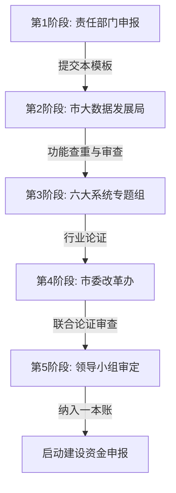

# 数字重庆"三张清单"申报模板 (V5.0版)

> **说明**：本模板严格依据《数字重庆建设市级应用“三张清单”论证审查办法（5.0版）》编制，适用于2026年及以后新立项的市级重大应用（包括“一件事”和“综合场景”）。请按必填项严格填报。

---

## 📋 立项流程说明 (V5.0新规)

### ⚠️ 严禁"体外循环"，必须严格经过以下五个阶段审查：



### 🔴 "一票否决"自查红线（申报前必测）
**凡触犯以下任一条，初审直接不通过：**
- [ ] **非刚需**：无法提供数据证明该事项属于"高频"、"重大"或"急需"。
- [ ] **无协同**：未跨越至少2个部门或2个层级（市/区县/镇街）。
- [ ] **伪流程**：未进行实质性的业务流程再造（新旧流程无变化）。
- [ ] **重复建设**：拟建功能在IRS"一本账"中已存在（如渝快办已有的功能）。
- [ ] **各种烟囱**：新建独立数据库库（不经IRS），或未在"三级治理中心"流转。
- [ ] **断头路**：业务涉及基层但未贯通"141"基层智治体系。

---

## 一、基本信息

| 项目 | 内容 |
|------|------|
| **应用名称**【必填】 | 【示例：智慧停车"一件事"】 |
| **申报单位**【必填】 | 【示例:重庆市城市管理局】 |
| **应用类型**【必填】 | ☐ "一件事"应用  ☐ "综合场景"应用 |
| **所属系统**【必填】 | ☐数字党建 ☐数字政务 ☐数字经济 ☑数字社会 ☐数字文化 ☐数字法治 |
| **AI模型使用**【新】 | ☐ 不涉及 ☐ 涉及（需提交《政务领域应用人工智能大模型登记表》） |
| **预计投资**【必填】 | 【示例：500万元】 |

---

## 二、清单一：重大需求清单

### 2.1 业务背景与痛点【必填】
**问题描述**：（建议采用“现状-问题-危害”结构，直击体制机制障碍）
```
【示例】
主城区停车难问题突出，现有车位利用率不足60%。
核心痛点：
1. 数据割裂：路内、路外、社会停车场数据未汇聚，形成"数据烟囱"。
2. 执法脱节：发现违停（城管）与处罚（公安）流程割裂，平均处置时长7天。
3. 基层负担：违停纠纷大量涌入社区，网格员缺乏有效处置工具。
```

### 2.2 政治能力与紧迫性【必填】
**政治对标**：（需精准引用时间、会议、原话）
- **总书记指示**：【20XX年X月X日，习近平总书记在...指出：“...”】
- **市委要求**：【202X年X月X日，袁家军书记在...强调：“...”】

**需求属性**：（**必须提供数据支撑，三选一**）
- ☑ **高频需求**：年均涉及【23000】件诉求/工单，办件量【50万】/年。
- ☑ **重大需求**：涉及【150万】市民切身利益 / 涉及【500亿】产业规模。
- ☐ **急需需求**：上级明确要求限期完成（文件号：【渝府办发〔202X〕XX号】）。

---

## 三、清单二：多跨场景清单

### 3.1 协同范围【必填】
- ☑ **跨部门**：涉及【城市管理局、公安局、交通局、发改委】等【4】个部门
- ☐ **跨层级**：涉及【市-区县-镇街】【3】级联动
- ☐ **跨区域**：涉及【渝中区、江北区...】等【X】个区县

### 3.2 场景拆解（V模型）【必填】

#### L1: 核心业务（Board）
【示例：城市停车综合治理】

#### L2: 一级场景（Scene）
| 序号 | 场景名称 | 对应痛点 | 是否闭环 |
|:----|:--------|:--------|:--------|
| 1 | 【停车资源全域共享】 | 【资源闲置】 | 是 |
| 2 | 【违停协同综合治理】 | 【执法联动难】 | 是 |

#### L3: 二级场景（Sub-Scene）
（一级场景的具体执行单元，必须可落地）
- **1.1 【车位实时查询与导航】**
- **1.2 【机关企事业单位错时共享】**
- **2.1 【违停智能感知与分拨】**
- **2.2 【多部门联合执法处置】**

#### L4: 业务事项与事件（Event）【V5.0核心】
**必须将业务事项排列组合形成"事件"，并明确流转路径：**

| 事件名称 | 触发条件 | 涉及事项 | 横向协同部门 | 纵向贯通层级 |
|:--------|:--------|:--------|:------------|:------------|
| 【违停协同处置事件】 | AI监测/群众举报 | 采集->分拨->执法->反馈 | 城管、公安 | 市->区->镇街->网格 |

### 3.3 "1361"架构融入【必填】

#### （1）平台能力（IRS赋能）
- **数据调用**：申请【人口库、法人库、车辆库、CIM地图】。
- **组件复用**：复用【统一身份认证、统一支付、渝快码】。
- **AI能力**：使用【视觉大模型】进行违停分析（需填报模型登记表）。

#### （2）三级治理中心（实战枢纽）
**必须描述事件流转逻辑：**
- **市级中心**：【态势监测、跨区调度、政策制定】
- **区县中心**：【接收市级预警、任务分派、监督闭环】（实战枢纽）
- **镇街中心**：【承接区县派单、调度网格员、反馈结果】

#### （3）两端赋能
- **渝快办（C/B端）**：【车主查询、缴费、投诉】
- **渝快政（G端）**：【执法人员接单、管理者看板】

#### （4）基层智治体系（141贯通）
**必填：如何贯通到网格？**
- **任务下发**：系统生成【违停劝导任务】 -> 流转至【基层智治平台】。
- **网格执行**：网格员在手机端接单 -> 现场劝导 -> 拍照反馈。
- **结果回传**：处置结果自动同步回应用后台。

---

## 四、清单三:重大改革清单

### 4.1 改革举措【必填】
（重点填写体制、机制、制度三类改革）

| 序号 | 改革类别 | 改革事项名称 | 核心举措（干货） | 标志性成果（法规/制度） |
|:----|:--------|:------------|:----------------|:-----------------------|
| 1 | 【机制改革】| 【跨部门联合执法】 | 建立城管+公安+交通违法信息互认机制，一次检查、多项处置。 | 《XX联合执法实施细则》 |
| 2 | 【制度改革】| 【数据共享管理】 | 强制全量接入商业/专用停车场数据，打破壁垒。 | 《重庆市停车数据管理办法》 |
| 3 | 【体制改革】| 【治理专班组建】 | 抽调多部门人员实体化办公。 | 专班成立批复文件 |

### 4.2 改革保障
- ☑ 已纳入市委深改委议题
- ☐ 已列入年度立法计划
- ☑ 已明确【渝中区】为试点区域

---

## 五、 附件清单
（V5.0新增要求）
- [ ] 1. **核心业务构架图**
- [ ] 2. **流程再造对比图**（原流程 vs 新流程）
- [ ] 3. **事件汇总表及流程图**
- [ ] 4. **政务领域应用人工智能大模型登记表**（如涉及AI）
- [ ] 5. **"三张清单"详细表**

---
**申报单位承诺**：本应用不存在重复建设、数据烟囱等"一票否决"情形，内容真实有效。

（盖章）        日期：2026年__月__日


