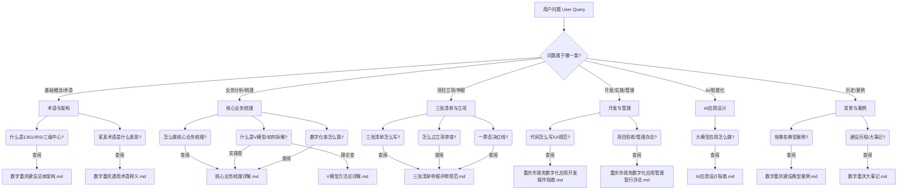

# 知识检索决策树 (Knowledge Retrieval Decision Tree)

## 使用说明
本决策树旨在通过结构化路径，帮助用户在海量数字重庆资料中快速定位最精准的文档。请根据用户问题的核心意图，按图索骥。

## 一、资源文件映射表 (Resource Map)

| 文件名 | 核心内容 | 适用场景 |
| :--- | :--- | :--- |
| **01. 基础理论类** | | |
| `数字重庆通用术语释义.md` | 术语定义、缩写解释 | 遇到“1361”、“IRS”、“三级中心”等术语时。 |
| `数字重庆建设总体架构.md` | 1361架构、平台能力 | 询问系统定位、顶层设计、平台关系时。 |
| `数字重庆大事记.md` | 发展历程、时间节点 | 需要了解政策背景、建设阶段、重要会议时。 |
| **02. 方法论与实操类** | | |
| `核心业务梳理详解.md` | **[NEW]** 梳理步骤、V模型拆解、链式/团式逻辑、数字化率计算 | **最核心**。开展业务梳理、画架构图、算数字化率时必查。 |
| `V模型方法论详解.md` | V模型理论、系统工程方法 | 深度理解V模型理论、需要做理论宣讲时。 |
| `三张清单申报评审规范.md` | 需求/改革/应用清单、立项审查 | 编制项目方案、准备立项材料、应对专家评审时。 |
| `重庆市政务数字化应用开发操作指南.md` | 开发规范、UI设计、技术栈 | 程序员开发阶段、UI设计、技术选型时。 |
| `重庆市政务数字化应用管理暂行办法.md` | 全生命周期管理、项目验收 | 查阅管理制度、验收标准、运维规范时。 |
| `AI应用设计指南.md` | 大模型、智能体、AI场景 | 设计AI+应用、大模型场景落地时。 |
| **03. 案例参考类** | | |
| `数字重庆建设典型案例.md` | 各领域优秀实战案例 | 寻找对标案例、通过案例理解抽象概念时。 |

---

## 二、问题类型决策树 (Decision Tree)

## 三、常用场景查询路径 (Scenario Paths)

### 场景 1：我要做一个新应用的立项方案
**路径**：
1.  **核心业务梳理** (`核心业务梳理详解.md`)：先理清业务架构，画出业务图。
2.  **三张清单编制** (`三张清单申报评审规范.md`)：基于梳理成果，填写需求、改革、应用三张清单。
3.  **架构对标** (`数字重庆建设总体架构.md`)：确保应用定位符合“1361”架构要求。

### 场景 2：领导让我搞懂“核心业务梳理”并组织培训
**路径**：
1.  **理论武装** (`V模型方法论详解.md`)：理解V模型背后的系统工程思想，用于讲PPT。
2.  **实操指南** (`核心业务梳理详解.md`)：掌握具体拆解步骤、颗粒度标准、避坑指南，用于指导填表。
3.  **计算指标** (`核心业务梳理详解.md`): 掌握数字化率计算公式，用于应付考核。

### 场景 3：开发人员开始写代码了
**路径**：
1.  **开发规范** (`重庆市政务数字化应用开发操作指南.md`)：遵循统一的UI风格、技术栈要求。
2.  **接入规范** (`数字重庆建设总体架构.md`): 了解如何接入IRS、视联网等基础平台。

### 场景 4：设计一个“AI+”创新场景
**路径**：
1.  **设计思路** (`AI应用设计指南.md`)：寻找大模型结合点。
2.  **参考案例** (`数字重庆建设典型案例.md`)：看看别人怎么做的（如渣土车、校园餐）。

## 四、高频术语速查表 (Top Terms)

| 术语 | 解释简述 | 详细出处 |
| :--- | :--- | :--- |
| **1361** | 1平台+3中心+6系统+1基层 | `总体架构.md` |
| **V模型** | 业务拆解(下行)与集成(上行)的方法论 | `V模型方法论详解.md` |
| **三张清单** | 需求清单、改革清单、应用清单 | `三张清单申报评审规范.md` |
| **核心业务** | 部门履职的最小单元集合 | `核心业务梳理详解.md` |
| **一件事** | 跨部门/跨层级协同的业务闭环 | `核心业务梳理详解.md` |
| **IRS** | 一体化智能化公共数据平台 | `总体架构.md` |
| **三级中心** | 市、区县、镇街三级治理中心 | `总体架构.md` |
| **一票否决** | 立项审查中的红线标准 | `三张清单申报评审规范.md` |
| **数字化率** | 衡量核心业务数字化程度的KPI | `核心业务梳理详解.md` |

---
**提示**：当用户提出的问题模糊不清时（如“怎么建设数字重庆”），请优先引导用户阅读 **`数字重庆建设总体架构.md`** 建立全局观。
